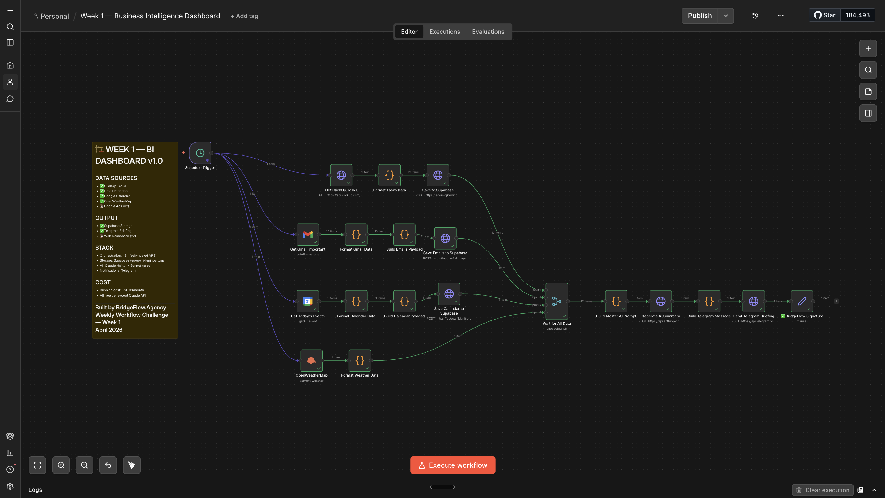
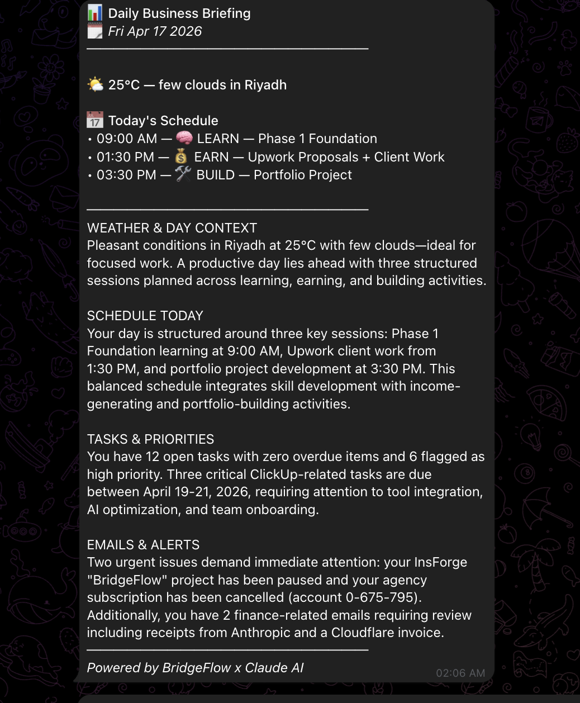

# Week 1 — Business Intelligence Dashboard

> **Weekly Workflow Challenge** — building one complex n8n workflow every week, in public.

An automated business intelligence system that runs every morning at 8am, pulls data from 4 sources, stores it in Supabase, generates an AI briefing via Claude, and delivers it to Telegram — with a live web dashboard to view everything at a glance.

---

## Live Dashboard

🌐 [weekly-workflow-challenge.vercel.app](https://weekly-workflow-challenge.vercel.app)

---

## What It Does

```
Schedule (8am daily)
    │
    ├── ClickUp API ──────── Tasks + priorities + due dates
    ├── Gmail OAuth ──────── Important unread emails
    ├── Google Calendar ──── Today's events
    └── OpenWeatherMap ───── Current weather
            │
            ▼
       Supabase (3 tables)
            │
            ├── Claude Haiku ── AI business briefing
            │        │
            │        └── Telegram Bot ── Daily HTML briefing
            │
            └── dashboard.html ── Live web dashboard
```

---

## Stack

| Layer | Tool |
|---|---|
| Orchestration | n8n (self-hosted VPS) |
| AI Briefing | Claude Haiku (Anthropic API) |
| Storage | Supabase (PostgreSQL) |
| Weather | OpenWeatherMap API |
| Notifications | Telegram Bot |
| Dashboard | Pure HTML/CSS/JS (no framework) |

---

## Files

```
Week 1 — Business Intelligence Dashboard/
├── Week 1 — Business Intelligence Dashboard.json   ← n8n workflow (credentials removed)
├── dashboard.html                                   ← web dashboard
├── Live_ Dashboard.png                              ← live dashboard screenshot
├── Workflow_screenshot.png                          ← n8n workflow screenshot
├── clickup_dashboard_screenshot.png                 ← ClickUp data proof
├── supabase_dashboard_screenshot.png                ← Supabase tables proof
└── telegram_dashboard_screenshot.png               ← Telegram briefing proof
```

---

## Setup

### 1. Supabase — Create 3 Tables

Run this SQL in your Supabase SQL editor:

```sql
-- Tasks
create table dashboard_tasks (
  id text primary key,
  name text,
  status text,
  priority text,
  due_date date,
  url text,
  list text
);

-- Emails
create table dashboard_emails (
  id text primary key,
  "from" text,
  subject text,
  snippet text,
  date timestamptz,
  category text,
  labels text[]
);

-- Calendar
create table dashboard_calendar (
  id text primary key,
  title text,
  start_time timestamptz,
  end_time timestamptz,
  description text,
  status text
);
```

### 2. Import Workflow into n8n

1. Open your n8n instance
2. Go to **Workflows → Import from file**
3. Select `Week 1 — Business Intelligence Dashboard.json`

### 3. Add Credentials

In n8n, go to **Credentials** and create one for each:

| Credential | Where to get it |
|---|---|
| `YOUR_CLICKUP_API_KEY` | ClickUp → Settings → Apps → API Token |
| `YOUR_CLICKUP_TEAM_ID` | ClickUp URL: `app.clickup.com/{TEAM_ID}/` |
| Gmail OAuth2 | n8n built-in → Google OAuth |
| Google Calendar OAuth2 | n8n built-in → Google OAuth |
| `YOUR_OPENWEATHERMAP_API_KEY` | openweathermap.org → API keys |
| `YOUR_SUPABASE_ANON_KEY` | Supabase → Settings → API |
| `YOUR_TELEGRAM_BOT_TOKEN` | Telegram → @BotFather → /newbot |
| `YOUR_TELEGRAM_CHAT_ID` | Telegram → @userinfobot |
| Anthropic API key | console.anthropic.com → API Keys |

### 4. Set Up the Web Dashboard

Open `dashboard.html` in a text editor and replace the credentials at the top of the `<script>` block:

```js
const SUPABASE_URL = 'https://YOUR_PROJECT.supabase.co';
const SUPABASE_KEY = 'YOUR_SUPABASE_ANON_KEY';
```

Then open `dashboard.html` in any browser — no server needed.

### 5. Activate

Toggle the workflow **Active** in n8n. It runs daily at 8am (cron: `0 8 * * *`).

To test immediately: open the workflow and click **Execute Workflow**.

---

## Dashboard Features

- **Weather** — current conditions placeholder (extend with live weather API)
- **Today's Schedule** — calendar events with times and status
- **Tasks & Priorities** — stats bar, priority breakdown, filter by urgency, overdue highlighting
- **Emails & Alerts** — grouped by category (Finance / High Priority / Updates)
- Auto-refreshes every 5 minutes
- Mobile responsive — no framework dependencies

---

## Telegram Briefing Example

```
📊 Daily Business Briefing
🗓 Saturday, April 18 2026
─────────────────────

🌤 24°C — Clear sky in Riyadh

📅 Today's Schedule
• 10:00 AM — Client call
• 02:00 PM — Team standup

─────────────────────
[AI-generated summary of tasks, emails, and priorities]
─────────────────────
Powered by BridgeFlow x Claude AI
```

---

## Cost

| Service | Cost |
|---|---|
| n8n (self-hosted) | ~$5/mo VPS |
| Supabase | Free tier |
| OpenWeatherMap | Free tier |
| Telegram Bot | Free |
| Claude Haiku | ~$0.03/month at daily usage |

**Total: ~$5/month** (essentially just the VPS)

---

## Screenshots

| Dashboard | Workflow | Telegram |
|---|---|---|
|  |  |  |

---

## About

Built by **[BridgeFlow.Agency](https://bridgeflow.agency)** — *I build AI systems that replace manual work.*

Part of the **Weekly Workflow Challenge** — one complex n8n workflow shipped every week, in public.

---

*Week 1 of ∞ — April 2026*
